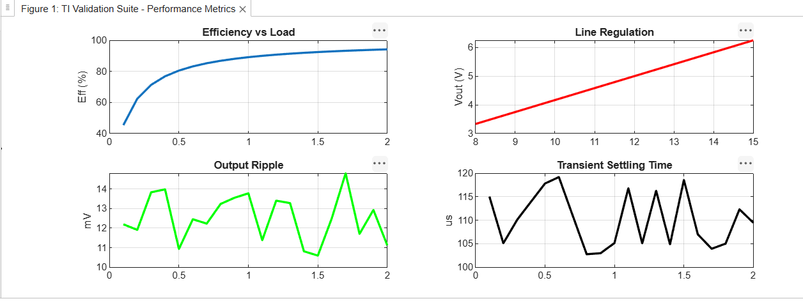

# Buck Converter Validation Suite

This project automates the performance characterization of a synchronous buck converter, mirroring industrial validation workflows for power management ICs.

## Overview
Automated MATLAB-based suite developed to analyze power management IC performance. This framework bridges the gap between raw laboratory data acquisition and professional-grade performance reporting.

## Key Features
- **Automated Sweeps:** Efficiently calculates efficiency, line/load regulation, and transient response metrics.
- **Data Export:** Standardized CSV logging for automated test result handling and audit trails.
- **Performance Analysis:** Visualizes device robustness under varying operating conditions, generating data ready for datasheet integration.

## Performance Metrics

## Technologies
- **MATLAB:** Data Analysis & Visualization
- **Data Logging:** CSV Workflow Automation
- **Instrumentation:** Designed for integration with LabVIEW/PyVISA test benches.
